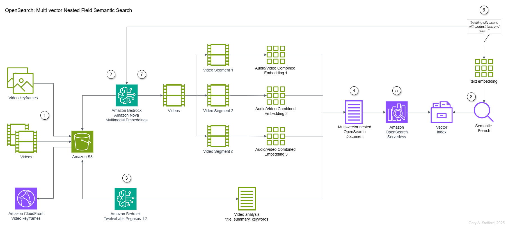
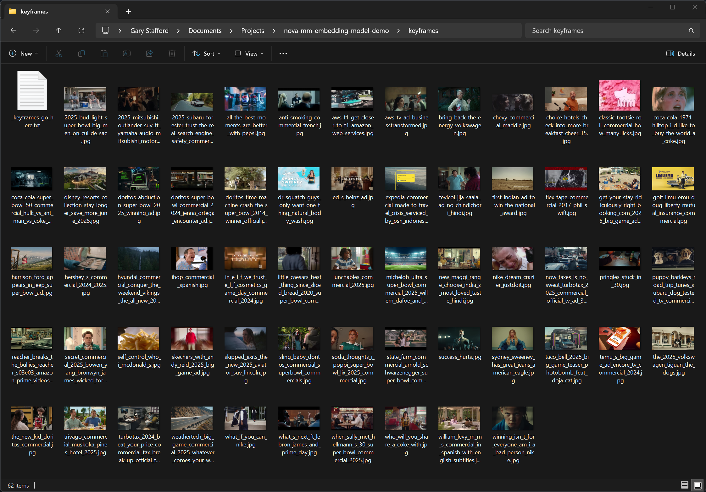
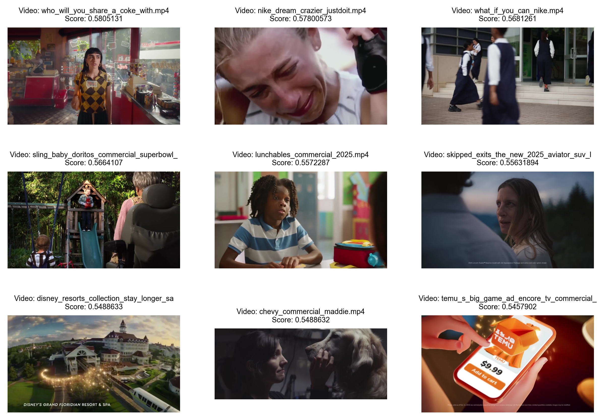
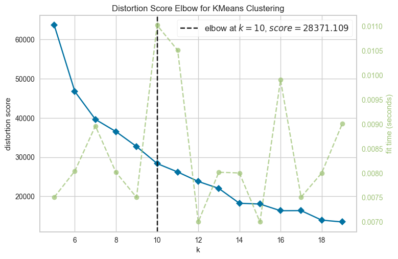
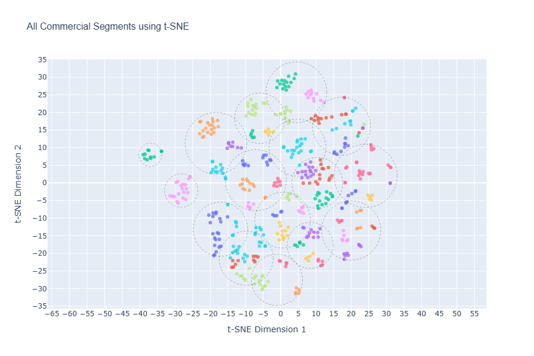

# Multi-Vector Semantic Search with Amazon Nova Multimodal Embeddings Model and OpenSearch

Demonstrating the use of Amazon Nova Multimodal Embeddings and TwelveLabs Pegasus 1.2 models on Amazon Bedrock along with Amazon OpenSearch Serverless to perform semantic search.



## Usage Instructions

### Prerequisites

- Python 3.12+
- AWS credentials
- Amazon S3 bucket
- Amazon OpenSearch Serverless collection (optional)
- [FFmpeg](https://ffmpeg.org/) (optional for keyframe generation)

### Installation

Clone the repository:

```bash
git clone https://github.com/garystafford/nova-mm-embedding-model-demo.git
cd nova-mm-embedding-model-demo
```

Rename `python-dotenv` file:

Mac:

```bash
mv env.txt .env
```

Windows:

```bat
rename env.txt .env
```

Enter the following environment variables in the `.env` file:

```ini
AWS_ACCESS_KEY_ID=<Your AWS Access Key ID>
AWS_SECRET_ACCESS_KEY=<Your AWS Secret Access Key>
AWS_SESSION_TOKEN=<Your AWS Session Token>

S3_VIDEO_STORAGE_BUCKET=<Your S3 Bucket Name>
OPENSEARCH_ENDPOINT=<Your OpenSearch Endpoint>
CLOUDFRONT_URL=<Your Amazon CloudFront Distribution>
```

Create a Python virtual environment for the Jupyter Notebook:

Mac:

```bash
python -m pip install virtualenv -Uq
python -m venv .venv
source .venv/bin/activate

python -m pip install -r requirements.txt -Uq
```

Windows:

```bat
python -m venv .venv
.venv\Scripts\activate

python -m pip install pip -Uq
python -m pip install -r requirements.txt -Uq
```

Check for FFmpeg:

```bash
ffmpeg -version
```

### Upload the Videos and Keyframes to S3

Videos and keyframes should be uploaded to the Amazon S3 buckets in `us-east-1`.

### Run the Code

Run the following Python scripts.

```bash
# Extract keyframes from videos
python ./extract_keyframe.py

# Generate embeddings using Amazon Nova Multimodal Embeddings
python ./generate_embeddings.py

# Generate video analyses using TwelveLabs Pegasus 1.2
python ./generate_analyses.py

# Prepare combined OpenSearch documents
python ./prepare_documents.py
```

Access the Jupyter Notebook for all OpenSearch-related code: [nova-mm-emd-opensearch-demo.ipynb](nova-mm-emd-opensearch-demo.ipynb)

## Alternative: Running OpenSearch in Docker

As an alternative to AWS, you can run OpenSearch locally using Docker. This is intended for development environments only and is not secure.

Mac:

```bash
docker swarm init

SWARM_ID=$(docker node ls --format "{{.ID}}")
docker stack deploy -c docker-compose.yml $SWARM_ID

docker service ls
```

Windows:

```bat
docker swarm init

for /f "delims=" %x in ('docker node ls --format "{{.ID}}"') do set SWARM_ID=%x
docker stack deploy -c docker-compose.yml %SWARM_ID%

docker service ls
```

## Basic OpenSearch Command

You can interact with your OpenSearch index in the Dev Tools tab of the OpenSearch Dashboards UI.

```text
GET tv-commercials-index/_settings

GET tv-commercials-index/_count

GET tv-commercials-index/_search
{
  "query": {
    "match_all": {}
  }
}
```

## Previews from Notebook

Television commercials used in video



Preview of search results with keyframe previews



“Elbow” method to help select the optimal number of clusters



All video segments plotted using t-SNE and K-Means clustering



---

_The contents of this repository represent my viewpoints and not those of my past or current employers, including Amazon Web Services (AWS). All third-party libraries, modules, plugins, and SDKs are the property of their respective owners._
