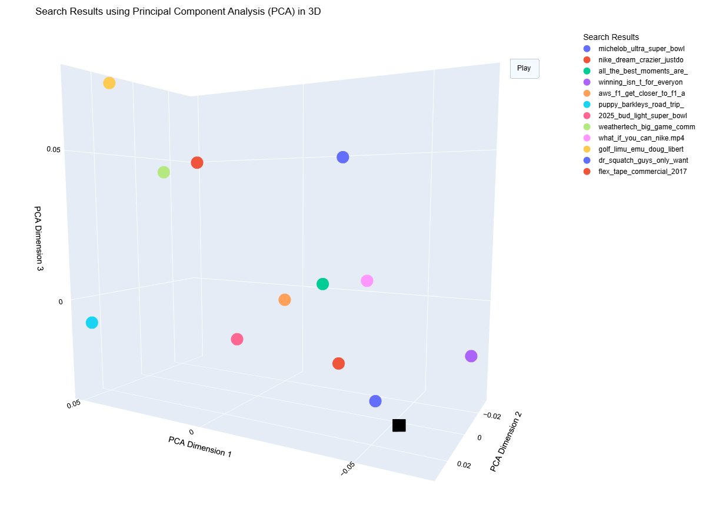

# Building a Multi-Vector Semantic Video Search System with Amazon Nova Multimodal Embeddings

## Introduction

The landscape of AI-powered search has been transformed with the recent release of Amazon Nova Multimodal Embeddings, a state-of-the-art embedding model designed for agentic RAG (Retrieval-Augmented Generation) and semantic search applications. What makes Amazon Nova Multimodal Embeddings truly groundbreaking is that it's the **first unified embedding model that supports text, documents, images, video, and audio through a single model**, enabling cross-modal retrieval with leading accuracy.

In this technical deep dive, we'll explore how to build a production-ready video semantic search system that combines:

- **Amazon Nova Multimodal Embeddings** for generating unified embeddings from video content
- **TwelveLabs Pegasus 1.2** for intelligent video analysis and metadata extraction
- **Amazon OpenSearch Serverless** for scalable vector search and retrieval

By the end of this post, you'll have a complete understanding of how to implement a multi-vector semantic search system that can find relevant video segments based on natural language queries, all powered by the latest multimodal AI models available on Amazon Bedrock.

## Architecture Overview

Our system follows a multi-stage pipeline that processes videos and enables semantic search capabilities:


The architecture consists of several key components:

1. **Video Input & Storage**: Videos are stored in Amazon S3 and distributed via CloudFront for efficient delivery
2. **Amazon Nova Multimodal Embeddings**: Generates segmented audio/video combined embeddings (1,024 dimensions)
3. **TwelveLabs Pegasus 1.2**: Performs comprehensive video analysis to generate titles, summaries, and keywords
4. **Multi-vector Nested OpenSearch Document**: Combines embeddings and analysis into searchable documents
5. **Amazon OpenSearch Serverless**: Stores and indexes documents with k-NN vector search capabilities
6. **Semantic Search**: Enables users to search videos using natural language queries

## Why Amazon Nova Multimodal Embeddings?

Amazon Nova Multimodal Embeddings represents a significant leap forward in embedding technology. Here's why it's ideal for video search:

### Unified Multimodal Understanding
Unlike traditional embedding models that require separate models for different modalities, Amazon Nova Multimodal Embeddings processes text, images, video, and audio through a single unified model. This ensures consistent representations across all content types.

### Optimized for Video Content
The model supports **AUDIO_VIDEO_COMBINED** embedding mode, which captures both visual and audio features from video content simultaneously. This holistic approach results in richer, more accurate embeddings that understand the complete context of video segments.

### Flexible Segmentation
Videos are automatically segmented into configurable chunks (we use 6-second segments), allowing for precise timestamp-accurate retrieval of relevant moments within longer videos.

### High-Dimensional Representations
With 1,024-dimensional embeddings, the model captures nuanced semantic information that enables accurate similarity search and retrieval.

### Async Processing at Scale
The model supports asynchronous batch processing through Amazon Bedrock's `start_async_invoke` API, making it efficient for processing large video libraries.

## Implementation Guide

Let's walk through the implementation of our semantic video search system. The complete code is available in the [GitHub repository](https://github.com/garystafford/nova-mm-embedding-model-demo).

### Prerequisites

Before we begin, ensure you have:

- Python 3.12+
- AWS credentials with access to Amazon Bedrock
- Amazon S3 bucket for video storage
- Amazon OpenSearch Serverless collection (optional - can use local Docker)
- FFmpeg for keyframe extraction (optional)

### Project Setup

First, clone the repository and set up your environment:

```bash
git clone https://github.com/garystafford/nova-mm-embedding-model-demo.git
cd nova-mm-embedding-model-demo
```

Create a `.env` file with your AWS credentials and configuration:

```ini
AWS_ACCESS_KEY_ID=<Your AWS Access Key ID>
AWS_SECRET_ACCESS_KEY=<Your AWS Secret Access Key>
AWS_SESSION_TOKEN=<Your AWS Session Token>

S3_VIDEO_STORAGE_BUCKET=<Your S3 Bucket Name>
OPENSEARCH_ENDPOINT=<Your OpenSearch Endpoint>
CLOUDFRONT_URL=<Your Amazon CloudFront Distribution>
```

Install the required dependencies:

```bash
python -m venv .venv
source .venv/bin/activate  # On Windows: .venv\Scripts\activate
python -m pip install -r requirements.txt
```

### Step 1: Data Models

We use Pydantic models to ensure type safety and data validation throughout our pipeline. Here are our core data models:

```python
from pydantic import BaseModel
from typing import List


class SegmentMetadataNova(BaseModel):
    segmentIndex: int
    segmentStartSeconds: float
    segmentEndSeconds: float


class VideoEmbeddingSegmentNova(BaseModel):
    embedding: List[float]
    status: str
    segmentMetadata: SegmentMetadataNova

    def __getitem__(self, item):
        return getattr(self, item)


class VideoEmbeddingsNova(BaseModel):
    videoName: str
    s3URI: str
    keyframeURL: str
    dateCreated: str
    sizeBytes: int
    durationSec: float = 0.0
    contentType: str
    embeddings: List[VideoEmbeddingSegmentNova]

    def __getitem__(self, item):
        return getattr(self, item)


# Data model for TwelveLabs Pegasus model for video analysis structure
class VideoAnalysisPegasus(BaseModel):
    videoName: str
    s3URI: str
    title: str
    summary: str
    keywords: list[str] = []
    dateCreated: str


class OpenSearchDocumentNova(BaseModel):
    videoName: str
    s3URI: str
    keyframeURL: str
    title: str
    summary: str
    keywords: List[str]
    dateCreated: str
    contentType: str
    sizeBytes: int
    durationSec: float = 0.0
    embeddings: List[VideoEmbeddingSegmentNova]
```

These models define the structure for:
- **SegmentMetadataNova**: Metadata for each video segment (index, timestamps)
- **VideoEmbeddingSegmentNova**: Individual segment embedding with metadata
- **VideoEmbeddingsNova**: Complete collection of embeddings for a video
- **VideoAnalysisPegasus**: Video analysis results from TwelveLabs Pegasus
- **OpenSearchDocumentNova**: Final document structure for indexing in OpenSearch

### Step 2: Generating Embeddings with Amazon Nova

The core of our system is the embedding generation using Amazon Nova Multimodal Embeddings. Here's the complete implementation:

```python
# Summary: This script generates video embeddings using the Amazon Bedrock Marengo model.
#          It retrieves video files from an S3 bucket, processes each video to generate embeddings,
#          and saves the results in a local directory.
# Author: Gary A. Stafford
# Date: 2025-07-23
# License: MIT License

import os
import time
import json

import boto3
from botocore.config import Config
from dotenv import load_dotenv

from utilities import Utilities
from data import VideoEmbeddingsNova

load_dotenv()  # Loads variables from .env file


AWS_REGION = os.getenv("AWS_REGION", "us-east-1")
S3_VIDEO_STORAGE_BUCKET = os.getenv("S3_VIDEO_STORAGE_BUCKET")
CLOUDFRONT_URL = os.getenv("CLOUDFRONT_URL")

MODEL_ID = "us.amazon.nova-2-multimodal-embeddings-v1:0"
S3_SOURCE_PREFIX = "nab"
S3_DESTINATION_PREFIX = "embeddings"
LOCAL_DESTINATION_DIRECTORY = "embeddings"
EMBEDDING_DIMENSION = 1_024


def main() -> None:

    config = Config(
        retries={
            "max_attempts": 5,
            "mode": "standard",  # Or 'adaptive' for a more sophisticated approach
        }
    )

    bedrock_runtime_client = boto3.client(
        service_name="bedrock-runtime", region_name=AWS_REGION, config=config
    )

    s3_client = boto3.client("s3", region_name=AWS_REGION)

    sts = boto3.client("sts")
    account_id = sts.get_caller_identity()["Account"]

    # Get the list of MP4 files from the specified S3 bucket
    video_file_names = Utilities.get_list_of_video_names_from_s3(
        s3_client, S3_VIDEO_STORAGE_BUCKET, S3_SOURCE_PREFIX
    )

    # Wait for the job to complete and then read the output
    for video_file_name in video_file_names:
        local_file_path = (
            f"{LOCAL_DESTINATION_DIRECTORY}/{video_file_name.replace('.mp4', '.json')}"
        )
        if os.path.exists(local_file_path):
            print(f"Skipping {video_file_name}, already processed.")
            continue

        video_key = f"{S3_SOURCE_PREFIX}/{video_file_name}"
        video_s3_uri = f"s3://{S3_VIDEO_STORAGE_BUCKET}/{video_key}"
        print(f"Generating analysis for video: {video_file_name}")

        # Get metadata for the S3 object
        metadata = Utilities.get_s3_object_metadata(
            s3_client, S3_VIDEO_STORAGE_BUCKET, video_key
        )

        # Generate embeddings for the video
        response = generate_embeddings(bedrock_runtime_client, account_id, video_s3_uri)

        # Wait for the job to complete
        print(f"Job started with invocation ARN: {response['invocationArn']}")
        invocation_arn = response["invocationArn"]
        final_job_status = Utilities.poll_job_status(
            bedrock_runtime_client, invocation_arn
        )
        print(f"Final job status: {final_job_status}")

        if final_job_status != "Completed":
            print(f"Skipping download, job did not complete successfully.")
            continue

        # Download the output file from S3
        s3_prefix = invocation_arn.split("/")[-1]
        s3_key = f"{S3_DESTINATION_PREFIX}/{s3_prefix}/embedding-audio-video.jsonl"
        content = download_embeddings_from_s3(s3_client, s3_key)

        embeddings = []
        for line in content.strip().split("\n"):
            if line:
                embeddings.append(json.loads(line))

        print(f"\nFound {len(embeddings)} video segments:")

        video_embeddings = VideoEmbeddingsNova(
            videoName=video_file_name,
            s3URI=video_s3_uri,
            keyframeURL=f"{CLOUDFRONT_URL}/{video_file_name.replace('.mp4', '.jpg')}",
            dateCreated=time.strftime("%Y-%m-%dT%H:%M:%S %Z", time.gmtime()),
            sizeBytes=metadata["ContentLength"],
            contentType=metadata["ContentType"],
            durationSec=round(
                embeddings[-1]["segmentMetadata"]["segmentEndSeconds"], 2
            ),
            embeddings=embeddings,
        )

        # Write the video embedding to a local file
        write_video_analysis_to_file(video_embeddings, local_file_path)
        print(f"Video embeddings written to: {local_file_path}\n")


def generate_embeddings(client: boto3.client, account_id: str, video_path: str) -> dict:
    """Start the video analysis job.
    Args:
        client (boto3.client): The Boto3 client for the Bedrock service.
        account_id (str): The AWS account ID.
        video_path (str): The S3 path to the video file.
    Returns:
        dict: The response from the video analysis job.
    """

    model_input = {
        "taskType": "SEGMENTED_EMBEDDING",
        "segmentedEmbeddingParams": {
            "embeddingPurpose": "GENERIC_INDEX",
            "embeddingDimension": EMBEDDING_DIMENSION,
            "video": {
                "format": "mp4",
                "embeddingMode": "AUDIO_VIDEO_COMBINED",
                "source": {
                    "s3Location": {"uri": video_path, "bucketOwner": account_id}
                },
                "segmentationConfig": {
                    "durationSeconds": 6  # Segment into 15-second chunks
                },
            },
        },
    }

    try:
        print(f"Starting embedding generation for video: {video_path}")
        response = client.start_async_invoke(
            modelId=MODEL_ID,
            modelInput=model_input,
            outputDataConfig={
                "s3OutputDataConfig": {
                    "s3Uri": f"s3://{S3_VIDEO_STORAGE_BUCKET}/{S3_DESTINATION_PREFIX}/",
                }
            },
        )
        return response
    except Exception as e:
        print(f"Error starting embedding generation: {e}")
        raise e


def download_embeddings_from_s3(
    client: boto3.client, s3_key: str
) -> VideoEmbeddingsNova:
    """Download the output file from S3 and save it locally.
    Args:
        client (boto3.client): The Boto3 S3 client.
        s3_key (str): The S3 key of the output file.
    Returns:
        VideoEmbeddingsNova: The video embedding object.
    """
    s3_object = client.get_object(
        Bucket=S3_VIDEO_STORAGE_BUCKET,
        Key=s3_key,
    )
    embeddings = s3_object["Body"].read().decode("utf-8")

    return embeddings


def write_video_analysis_to_file(
    video_embeddings: VideoEmbeddingsNova, local_file_path: str
) -> None:
    """Write the video analysis response to a local file.
    Args:
        video_analysis (VideoEmbeddingsNova): The video analysis object containing the response.
        local_file_path (str): The local file path where the response will be written.
    """
    with open(local_file_path, "w") as f:
        f.write(video_embeddings.model_dump_json(indent=2))


if __name__ == "__main__":
    main()
    print("Video embeddings generation completed successfully.")
```

#### Key Features of the Embedding Generation Process:

**Asynchronous Processing**: The code uses `start_async_invoke()` for non-blocking batch processing, ideal for large video libraries.

**Segmented Embeddings**: Videos are divided into 6-second segments, allowing for precise moment-level search within videos.

**Combined Audio/Video Mode**: Using `AUDIO_VIDEO_COMBINED` ensures the embeddings capture both visual and audio features.

**1,024-Dimensional Vectors**: High-dimensional embeddings provide rich semantic representations for accurate similarity matching.

**Automatic Polling**: The utility function polls the job status and waits for completion before downloading results.

### Step 3: Video Analysis with TwelveLabs Pegasus 1.2

While embeddings capture semantic meaning, structured metadata makes results more interpretable. We use TwelveLabs Pegasus 1.2 to generate titles, summaries, and keywords:

```python
# Summary: This script generates video analyses using the Amazon Bedrock Pegasus model.
#          It retrieves video files from an S3 bucket, processes each video to generate a
#          title, summary, and keywords, and saves the results in a local directory.
# Author: Gary A. Stafford
# Date: 2025-07-23
# License: MIT License

import os
import json
import time
import random

from dotenv import load_dotenv
import boto3
from botocore.config import Config

from utilities import Utilities
from data import VideoAnalysisPegasus

load_dotenv()  # Loads variables from .env file

AWS_REGION = os.getenv("AWS_REGION", "us-east-1")
S3_VIDEO_STORAGE_BUCKET = os.getenv("S3_VIDEO_STORAGE_BUCKET")

MODEL_ID = "us.twelvelabs.pegasus-1-2-v1:0"
S3_SOURCE_PREFIX = "commercials"
LOCAL_DESTINATION_DIRECTORY = "analyses"


def main() -> None:
    config = Config(
        retries={
            "max_attempts": 5,
            "mode": "standard",  # Or 'adaptive' for a more sophisticated approach
        }
    )

    bedrock_runtime_client = boto3.client(
        service_name="bedrock-runtime", region_name=AWS_REGION, config=config
    )

    s3_client = boto3.client("s3", region_name=AWS_REGION)

    sts = boto3.client("sts")
    account_id = sts.get_caller_identity()["Account"]

    # Get the list of MP4 files from the specified S3 bucket
    video_file_names = Utilities.get_list_of_video_names_from_s3(
        s3_client, S3_VIDEO_STORAGE_BUCKET, S3_SOURCE_PREFIX
    )

    # Wait for the job to complete and then read the output
    for video_file_name in video_file_names:
        local_file_path = (
            f"{LOCAL_DESTINATION_DIRECTORY}/{video_file_name.replace('.mp4', '.json')}"
        )
        if os.path.exists(local_file_path):
            print(f"Skipping {video_file_name}, already processed.")
            continue

        video_path = (
            f"s3://{S3_VIDEO_STORAGE_BUCKET}/{S3_SOURCE_PREFIX}/{video_file_name}"
        )
        print(f"Generating analysis for video: {video_file_name}")

        # Define the prompts for title, summary, and keywords
        prompt_summary = "Generate a detailed summary of the video. Consider the visual, audio, textual, spatial, and temporal aspects in the video. Only provide the summary in the response; no pre-text, post-text, or quotation marks."
        prompt_title = "Generate a descriptive title for the video. Only provide the title in the response; no pre-text, post-text, or quotation marks."
        prompt_keywords = """Extract keywords from the video content as a list of strings, for example: ["keyword1", "keyword2", "keyword3", "keyword4"]. Only provide the list keywords in the response; no pre-text, post-text."""

        response_title = generate_video_analysis(
            bedrock_runtime_client, account_id, video_path, prompt_title
        )

        response_summary = generate_video_analysis(
            bedrock_runtime_client, account_id, video_path, prompt_summary
        )

        response_keywords = generate_video_analysis(
            bedrock_runtime_client, account_id, video_path, prompt_keywords
        )

        video_analysis = VideoAnalysisPegasus(
            videoName=video_file_name,
            s3URI=video_path,
            title=response_title["message"],
            summary=response_summary["message"],
            keywords=json.loads(response_keywords["message"]),
            dateCreated=time.strftime("%Y-%m-%dT%H:%M:%S %Z", time.gmtime()),
        )

        # Write the video analysis to a local file
        write_video_analysis_to_file(video_analysis, local_file_path)
        print(f"Video analysis written to: {local_file_path}")


def generate_video_analysis(
    client: boto3.client,
    account_id: str,
    video_path: str,
    prompt: str,
    max_retries: int = 5,
) -> dict:
    """Start the video analysis job.

    Args:
        client (boto3.client): The Boto3 client for the Bedrock service.
        account_id (str): The AWS account ID.
        video_path (str): The S3 path to the video file.
        prompt (str): The prompt to use for the video analysis.
        max_retries (int, optional): The maximum number of retry attempts. Defaults to 3.

    Raises:
        e: An error occurred while starting the video analysis job.

    Returns:
        dict: The response from the video analysis job.
    """

    # Reference: https://docs.aws.amazon.com/bedrock/latest/userguide/model-parameters-pegasus.html
    request_body = {
        "inputPrompt": prompt,
        "mediaSource": {
            "s3Location": {
                "uri": video_path,
                "bucketOwner": account_id,
            }
        },
        "temperature": 0.2,
        # "maxOutputTokens": 2048,
        # "responseFormat": {
        #     "type": "json_schema",
        #     "json_schema": {
        #         "name": "video_analysis",
        #         "schema": {
        #             "type": "object",
        #             "properties": {
        #                 "summary": {"type": "string"},
        #                 "key_scenes": {"type": "array", "items": {"type": "string"}},
        #                 "duration": {"type": "string"},
        #             },
        #             "required": ["summary", "key_scenes"],
        #         },
        #     },
        # },
    }

    retries = 0
    while True:
        try:
            response = client.invoke_model(
                modelId=MODEL_ID,
                body=json.dumps(request_body),
                contentType="application/json",
                accept="application/json",
            )
            response_body = json.loads(response["body"].read())
            return response_body
        except Exception as e:
            if "ThrottlingException" in str(e) and retries < max_retries:
                retries += 1
                backoff_time = (2**retries) + random.uniform(
                    0, 1
                )  # Exponential backoff with jitter
                print(
                    f"Throttled. Retrying in {backoff_time:.2f} seconds (attempt {retries})..."
                )
                time.sleep(backoff_time)
            else:
                raise e  # Re-raise the exception if it's not a retryable error or max retries reached


# method that writes the video analysis response to a local file
def write_video_analysis_to_file(
    video_analysis: VideoAnalysisPegasus, local_file_path: str
) -> None:
    """Write the video analysis response to a local file.
    Args:
        video_analysis (VideoAnalysisPegasus): The video analysis object containing the response.
        local_file_path (str): The local file path where the response will be written.
    """
    with open(local_file_path, "w") as f:
        f.write(video_analysis.model_dump_json(indent=2))
    print(f"Response written to {local_file_path}")


if __name__ == "__main__":
    main()
    print("Video analysis completed successfully.")
```

#### What TwelveLabs Pegasus Provides:

**Descriptive Titles**: Concise, human-readable titles that summarize video content

**Detailed Summaries**: Comprehensive analysis considering visual, audio, textual, spatial, and temporal aspects

**Keyword Extraction**: Structured JSON lists of key concepts, objects, and themes

**Robust Error Handling**: Exponential backoff with jitter handles API throttling gracefully

**Low Temperature**: Setting temperature to 0.2 ensures consistent, deterministic outputs

### Step 4: Preparing OpenSearch Documents

Now we combine the embeddings and analyses into unified OpenSearch documents:

```python
# Summary: This script prepares OpenSearch documents from video analyses and embeddings.
#          It reads video analysis and embedding data from local JSON files, constructs OpenSearch documents,
#          and saves them in a specified directory.
# Author: Gary A. Stafford
# Date: 2025-07-23
# License: MIT License

import json
import os
import time

from data import OpenSearchDocumentNova, VideoAnalysisPegasus, VideoEmbeddingsNova

LOCAL_EMBEDDINGS_DIRECTORY = "embeddings"
LOCAL_ANALYSIS_DIRECTORY = "analyses"
LOCAL_OPENSEARCH_DIRECTORY = "documents"


def main():
    for analysis_file in os.listdir(LOCAL_ANALYSIS_DIRECTORY):
        if not analysis_file.endswith(".json"):
            print(f"Skipping {analysis_file}, not a JSON file.")
            continue

        print(f"Generating OpenSearch document for: {analysis_file}")

        # Construct file paths for embeddings and analysis
        embeddings_file_path = os.path.join(LOCAL_EMBEDDINGS_DIRECTORY, analysis_file)
        analysis_file_path = os.path.join(LOCAL_ANALYSIS_DIRECTORY, analysis_file)

        # Read the JSON files
        try:
            embeddings = VideoEmbeddingsNova(**read_json_file(embeddings_file_path))
            analysis = VideoAnalysisPegasus(**read_json_file(analysis_file_path))

            # Prepare OpenSearch document
            opensearch_document: OpenSearchDocumentNova = prepare_opensearch_documents(
                embeddings, analysis
            )

            # Write the OpenSearch document to a file
            write_opensearch_document(analysis_file, opensearch_document)
        except FileNotFoundError as e:
            print(e)
            continue


def write_opensearch_document(
    analysis_file: str, opensearch_document: OpenSearchDocumentNova
) -> None:
    """Write the OpenSearch document to a file in the local directory.
    :param analysis_file: Name of the analysis file (used for naming the output).
    :param opensearch_document: OpenSearchDocumentNova object to write.
    :return: None
    """
    os.makedirs(LOCAL_OPENSEARCH_DIRECTORY, exist_ok=True)
    output_file_path = os.path.join(LOCAL_OPENSEARCH_DIRECTORY, analysis_file)
    with open(output_file_path, "w") as output_file:
        json.dump(opensearch_document.model_dump(), output_file, indent=2)


def read_json_file(file_path: str) -> dict:
    """Read a JSON file and return the parsed data.
    :param file_path: Path to the JSON file.
    :return: Parsed JSON data as a dictionary.
    :raises FileNotFoundError: If the file does not exist.
    """
    if not os.path.exists(file_path):
        raise FileNotFoundError(f"File not found: {file_path}")

    with open(file_path, "r") as file:
        data = json.load(file)

    return data


def prepare_opensearch_documents(
    embeddings: VideoEmbeddingsNova, analysis: VideoAnalysisPegasus
) -> OpenSearchDocumentNova:
    """Prepare OpenSearch document from video embeddings and analysis data.
    :param embeddings: VideoEmbeddingsNova object containing vector embeddings.
    :param analysis: VideoAnalysisPegasus object containing video analysis data.
    :return: OpenSearchDocument object ready for indexing.
    """

    document = OpenSearchDocumentNova(
        videoName=analysis.videoName,
        s3URI=analysis.s3URI,
        keyframeURL=embeddings.keyframeURL,
        title=analysis.title,
        summary=analysis.summary,
        keywords=analysis.keywords,
        dateCreated=time.strftime("%Y-%m-%dT%H:%M:%S %Z", time.gmtime()),
        contentType=embeddings.contentType,
        sizeBytes=embeddings.sizeBytes,
        durationSec=embeddings.durationSec,
        embeddings=embeddings.embeddings,
    )

    return document


if __name__ == "__main__":
    main()
    print("OpenSearch documents prepared successfully.")
```

### Step 5: Utility Functions

Here are the utility functions that support the pipeline:

```python
from typing import List
import time

import boto3


class Utilities:
    @staticmethod
    def get_list_of_video_names_from_s3(
        client: boto3.client, bucket: str, prefix: str
    ) -> List[str]:
        """Get a list of video file names from an S3 bucket with the specified prefix.
        Args:
            client (boto3.client): The Boto3 S3 client.
            bucket (str): The name of the S3 bucket.
            prefix (str): The prefix to filter the objects.
        Returns:
            List[str]: A list of video file names (with .mp4 extension) in the specified S3 bucket.
        """
        response = client.list_objects_v2(Bucket=bucket, Prefix=prefix)

        video_files = []
        if "Contents" in response:
            for obj in response["Contents"]:
                if obj["Key"].endswith(".mp4"):
                    filename = obj["Key"].split("/")[-1]
                    video_files.append(filename)
        return video_files

    @staticmethod
    def get_s3_object_metadata(client: boto3.client, bucket: str, key: str) -> dict:
        """Get metadata for an S3 object.
        Args:
            client (boto3.client): The Boto3 S3 client.
            bucket (str): The name of the S3 bucket.
            key (str): The key of the S3 object.
        Returns:
            dict: The metadata of the S3 object.
        """
        response = client.head_object(Bucket=bucket, Key=key)
        return response

    @staticmethod
    def poll_job_status(client: boto3.client, invocation_arn: str) -> str:
        """Poll the job status until it is completed or failed.
        Args:
            client (boto3.client): The Boto3 client for the Bedrock service.
            invocation_arn (str): The ARN of the job invocation.
        Returns:
            str: The final job status.
        """
        while True:
            response = client.get_async_invoke(invocationArn=invocation_arn)
            status = response["status"]

            print(f"Invocation status: {status}")

            if status == "Completed":
                print("Job completed!")
                break
            elif status == "Failed":
                print(f"Job failed: {response.get('failureMessage')}")
                break
                # raise Exception("Job failed")
            else:
                # Still in progress, so wait and retry
                time.sleep(10)  # Adjust polling interval as necessary
        return response["status"]
```

### Step 6: Running the Pipeline

Execute the pipeline in sequence:

```bash
# Extract keyframes from videos (optional)
python ./extract_keyframe.py

# Generate embeddings using Amazon Nova Multimodal Embeddings
python ./generate_embeddings.py

# Generate analyses using TwelveLabs Pegasus 1.2
python ./generate_analyses.py

# Prepare combined OpenSearch documents
python ./prepare_documents.py
```

### Step 7: OpenSearch Integration and Semantic Search

The final step is indexing documents in OpenSearch and performing semantic searches. The complete implementation is available in the Jupyter notebook `nova-mm-emd-opensearch-demo.ipynb`.

#### OpenSearch Index Configuration

The index uses nested field mapping to support multiple embeddings per document:

```json
{
  "settings": {
    "index.knn": true,
    "number_of_shards": 2,
    "number_of_replicas": 0
  },
  "mappings": {
    "properties": {
      "videoName": {"type": "keyword"},
      "s3URI": {"type": "keyword"},
      "keyframeURL": {"type": "keyword"},
      "title": {"type": "text"},
      "summary": {"type": "text"},
      "keywords": {"type": "keyword"},
      "dateCreated": {"type": "date"},
      "contentType": {"type": "keyword"},
      "sizeBytes": {"type": "long"},
      "durationSec": {"type": "float"},
      "embeddings": {
        "type": "nested",
        "properties": {
          "embedding": {
            "type": "knn_vector",
            "dimension": 1024,
            "method": {
              "engine": "faiss",
              "space_type": "cosinesimil",
              "name": "hnsw",
              "parameters": {
                "ef_construction": 512,
                "m": 16
              }
            }
          },
          "status": {"type": "keyword"},
          "segmentMetadata": {
            "properties": {
              "segmentIndex": {"type": "integer"},
              "segmentStartSeconds": {"type": "float"},
              "segmentEndSeconds": {"type": "float"}
            }
          }
        }
      }
    }
  }
}
```

#### Key Configuration Details:

- **k-NN enabled**: `index.knn: true` enables vector search
- **FAISS engine**: Fast, efficient similarity search
- **HNSW algorithm**: Hierarchical Navigable Small World for approximate nearest neighbor search
- **Cosine similarity**: Measures semantic similarity between embeddings
- **Nested field**: Allows multiple embeddings per document while maintaining segment metadata

#### Performing Semantic Search

To search videos, we first convert the user's query to an embedding using Amazon Nova, then perform a k-NN search:

```python
# Generate query embedding
query_text = "kids playing in a park"
query_embedding = generate_text_embedding(query_text)

# k-NN search query
search_query = {
    "size": 9,
    "_source": {
        "excludes": ["embeddings.embedding"]
    },
    "query": {
        "nested": {
            "path": "embeddings",
            "query": {
                "knn": {
                    "embeddings.embedding": {
                        "vector": query_embedding,
                        "k": 9
                    }
                }
            },
            "score_mode": "max"
        }
    }
}

# Execute search
results = opensearch_client.search(
    index="tv-commercials-index-nova-mm",
    body=search_query
)
```

## Results and Visualizations

Our system provides rich visualizations to understand search results and embedding spaces:

### Search Results Grid

Results are displayed with keyframe thumbnails and similarity scores:


### t-SNE Visualizations

We can visualize the high-dimensional embedding space in 2D using t-SNE:


This visualization shows how video segments cluster together based on semantic similarity, with the user query positioned relative to relevant results.

### K-Means Clustering Analysis

Using the "elbow method," we determine the optimal number of clusters:


This helps identify natural groupings in the video content, useful for content organization and recommendation systems.

### 3D Embedding Space

A 3D t-SNE projection provides an interactive view of the embedding space:



## Advanced Search Capabilities

Our system supports multiple search strategies:

### 1. Basic Nested k-NN Search
Returns top k similar video segments based on cosine similarity.

### 2. Filtered Search
Combines vector similarity with metadata filters (e.g., duration range).

### 3. Inner Hits Search
Returns specific matching segments within videos with timestamps.

### 4. Radial Search
Finds all videos within a maximum distance threshold.

### 5. Segment-Level Filtering
Searches specific segment indices across all videos.

## Real-World Use Cases

This architecture enables numerous applications:

### Content Discovery
Find relevant video content using natural language queries, without relying on manual tagging or metadata.

### Moment-Level Search
Locate specific scenes within long videos with timestamp accuracy.

### Cross-Language Search
Semantic understanding transcends language barriers, enabling search across multilingual content.

### Content Recommendation
Use clustering and similarity to recommend related videos.

### Video Cataloging
Automatically organize large video libraries by semantic themes.

### Compliance and Moderation
Quickly find specific content types for review and compliance purposes.

## Performance Considerations

### Embedding Generation
- Async processing scales to large video libraries
- 6-second segments provide good balance between granularity and performance
- Batch processing reduces API calls

### Search Performance
- FAISS engine with HNSW provides sub-100ms search times
- Nested field structure supports multi-vector search efficiently
- Cosine similarity is optimized for normalized embeddings

### Cost Optimization
- Use S3 lifecycle policies for processed videos
- CloudFront caching reduces bandwidth costs
- OpenSearch Serverless auto-scales based on usage

## Conclusion

Amazon Nova Multimodal Embeddings represents a major advancement in multimodal AI, providing unified embeddings across text, images, video, and audio through a single model. Combined with TwelveLabs Pegasus 1.2 for intelligent video analysis and Amazon OpenSearch Serverless for scalable vector search, we have a production-ready system for semantic video search.

The key advantages of this architecture include:

✅ **Unified Embeddings**: Single model handles all modalities
✅ **Segment-Level Precision**: Find exact moments within videos
✅ **Scalable Processing**: Async batch processing for large libraries
✅ **Rich Metadata**: Structured analysis complements semantic embeddings
✅ **Multiple Search Modes**: Flexible querying for different use cases
✅ **Production-Ready**: Serverless architecture scales automatically

Whether you're building a video streaming platform, content management system, or AI-powered search application, this architecture provides a solid foundation for semantic video search.

## Resources

- **GitHub Repository**: [nova-mm-embedding-model-demo](https://github.com/garystafford/nova-mm-embedding-model-demo)
- **Amazon Bedrock Documentation**: [Bedrock User Guide](https://docs.aws.amazon.com/bedrock/)
- **Amazon Nova Multimodal Embeddings**: [Model Details](https://docs.aws.amazon.com/bedrock/latest/userguide/model-parameters-embed.html)
- **TwelveLabs Pegasus Documentation**: [Pegasus Model Guide](https://docs.aws.amazon.com/bedrock/latest/userguide/model-parameters-pegasus.html)
- **OpenSearch k-NN Plugin**: [k-NN Documentation](https://opensearch.org/docs/latest/search-plugins/knn/)

## About the Author

This demonstration was created by Gary A. Stafford. The complete source code is available under the MIT License.

---

*The contents of this article represent the author's viewpoints and not those of any past or current employers, including Amazon Web Services (AWS). All third-party libraries, modules, plugins, and SDKs are the property of their respective owners.*
